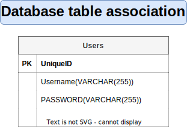
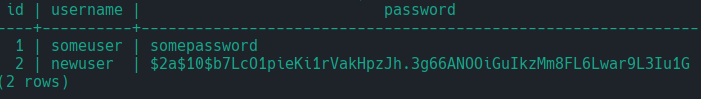

# Express authentication with postgres backend

This is a breakdown of a initial setup of authentication using express, passport.js, bcrypt along with a postgresSQL database to establish a secure user authentication experience

For the purposes of this breakdown, most parts of the project will be set up and placed in app.js, while the step by step approach is broken down here.

In a real world application, it would be essential to split the seperation of concerns as needed, this can depend on the project however and will be left at your discretion as to how that should be done.

This breakdown assumes you have already installed and established postgreSQL either locally on your machine for dev purposes, or know how to establish one in the cloud.

For the purposes of this project, I have a local postgreSQL setup for development, that can be carried over to a Saas solution as needed.

Without further ado, let's get started

## Step 1 - Database Setup

To start we will establish a database within psql, the CLI postgreSQL query tool.

### Step 1.1 - New database

So using the terminal, access the tool.

```bash
psql
```

using psql, establish a new database.

```bash
NEW DATABASE <insert-database-name-here>
```

Confirm it has been established by listing all available databases

```bash
\l
```

Once found, connect to it.

```bash
\c <database-name-here>
```

### Step 1.2 - New table

We are now ready to query our database!

Lets start with a table
For our authentication uses, we will need a users table.
The users table will need to be populated with rows consisting of:
a unique identifier (id),
a username (VARCHAR)
And a password (VARCHAR)



So let's query it up!

```sql
CREATE TABLE users(
    id INTEGER PRIMARY KEY GENERATED ALWAYS AS IDENTITY,
    username VARCHAR( 255 ),
    password VARCHAR( 255 )
);
```

With this our users table is established.

Verify that the table has been established by querying a select of it.

```sql
SELECT * FROM users;
```

And it should return an empty table.

### Step 1.3 - Insert into table

now, we can insert new rows using

```sql
INSERT INTO users(username, password) VALUES('some-username', 'some-secured-password');
```

`username` and `password` will be the data that we will be populating in each row.
and will accept up to 255 character long inputs.

The `id` column will automatically be managed by SQL, ever incrementing as more data
is added thanks to the `IDENTITY` clause.

The benefits of doing it like this, is mainly that each row will have a unique identifer.
This will also simplify insertion operations as postgreSQL will manage unique IDs for us.

## Step 2 - Express setup

Initialize our node environment so we can install our packages

### Step 2.1 - Initialize node environment

```bash
npm init -y
```

This will establish the work directory as a node environment and create a fresh
`package.json` file.

While were add it, go to `package.json` and add the watch line under scripts.
This will allow us to easily wind up our app during development.

```json
  "scripts": {
    "test": "echo \"Error: no test specified\" && exit 1",
    "watch": "node --watch app.js" // add new script command.
  },
```

Now that we have a database to interact with, we will need a application.

### Step 2.2 - Install Express and middleware

We will use express, and various useful middleware to establish an application that can
create, authenticate and manage user data.

For this, we will use the node package manager to install express along with the following middleware.

```bash
npm install express express-session pg passport passport-local ejs dotenv
```

-   [Express](http://expressjs.com/), will be our application framework.

-   [express-session](https://www.npmjs.com/package/express-session), will help us manage our user sessions using browser cookies.

-   [pg](https://www.npmjs.com/package/pg) will help us manage our postgreSQL operations and authorization.

-   [passport](https://www.npmjs.com/package/passport), will allow us to establish authentication and authentication strategies throughout our application. (more on this in a bit)

-   [passport-local](https://www.passportjs.org/packages/passport-local/), is the specific passport authentication strategy that we will establish for the purposes of this project. There are alot of different viable strategies to draw inspiration from, but this one is a common one for local authentication.

-   [ejs] or Embedded Javascript Templates will be a render engine that we will use for the purposes of rendering views and executing javascript through the same files.

-   [dotenv](https://www.npmjs.com/package/dotenv) will allow us to load environment variables safely from .env into our process.env object.

## Step 3 - The express app

We will start by establishing a very basic express application.
For the moment, we will not yet secure the passwords and just use plain text passwords. **This should never ever be done in a serious production**, and will be fixed later down the line.

### Step 3.1 - app.js

So, let's create `app.js` and get to coding!

```javascript
/* Import our middleware */
const { Pool } = require('pg');
const express = require('express');
const session = require('express-session');
const passport = require('passport');
const LocalStrategy = require('passport-local').Strategy;
require('dotenv').config();

/* configure our postgres pool, that will be used to authenticate access to the database */
const pool = new Pool({
    /* use dotenv to safely store our actual connection strings in a secret .env file */
    // refer to a locally stored dev database connection string, alternatively a production string.
    // A connection string should be in the following format
    // postgresql://<database-power-user>:<database-password>@<database-host>:<database-port>/<database-name>
    connectionString: process.env.DATABASE_URL_DEV || process.env.DATABASE_URL,
});

/* Establish our express app */
const app = express();

/* Configure express app */
// Set up our views directory
app.set('views', __dirname);
// configure our app to use ejs as our view engine
app.set('view engine', 'ejs');

// configure session middleware.
// It is not something that will be used directly outside of this.
// It is a prerequisite for passport, which will see heavy use however.
app.use(
    session({
        // Establish a secret, pulled from our environment secrets
        // This will be used to sign each session ID cookie
        secret: process.env.SESSION_SECRET,
        // Because we are using this for establishing login sessions, the following options
        // should be disabled (true by default)
        // Forces the session to be saved back to the session store if true.
        resave: false,
        // Forces a session that is unitizialized to be saved to teh store if enabled.
        // A session that is new, but not modified, is uninitizialised.
        saveUninitialized: false,
    })
);

// Initialize our passport session middleware
app.use(passport.session());

// Configure express to parse url data to request body.
app.use(express.urlencoded({ extended: false }));

// Establish our first route, rendering the index view when requested.
app.get('/', (req, res) => res.render('index'));

// Configure app to listen to port, pulled from environment secrets.
app.listen(process.env.PORT, () =>
    console.log('App listening on port ', process.env.PORT)
);

// The app is now ready for use!
```

## Step 4 - The views.

During our application setup, we set up a single route rendering a index view.

### Step 4.1 - index.ejs

lets make that now, create a `index.ejs` file.

```javascript
<!DOCTYPE html>
<html lang="en">
    <head>
        <meta charset="UTF-8" />
        <meta
            name="viewport"
            content="width=device-width, initial-scale=1.0"
        />
        <title></title>
    </head>
    <body>
        <h1>Hello world</h1>
    </body>
</html>
```

This will serve as the page that we will secure and attempt to create access to.

In order for us to authorize access, we will need users to give access to.
So lets create view, that will allow new users to sign up to our amazing website.

### Step 4.2 - sign-up-form.ejs

Create `sign-up-form.ejs`

```javascript
<!DOCTYPE html>
<html lang="en">
    <head>
        <meta charset="UTF-8" />
        <meta
            name="viewport"
            content="width=device-width, initial-scale=1.0"
        />
        <title></title>
    </head>
    <body>
        <h1>Sign up!</h1>
        <form
            action=""
            method="post"
        >
            <label for="username">Username:</label>
            <input
                type="text"
                name="username"
                id="username"
                placeholder="username..."
            />
            <label for="password">password:</label>
            <input
                type="password"
                name="password"
                id="password"
            />
            <button>Sign up</button>
        </form>
    </body>
</html>
```

With this, we create a simple form that will allow a user to submit a desired username and password.

### Step 4.3 - GET Routes for views

Remember to establish a route for the views in `app.js`.

```javascript
// Establish second route, rendering the sign-up-form view when requested.
app.get('/', (req, res) => res.render('index'));
app.get('/sign-up', (req, res) => res.render('sign-up-form'));
```

### Step 4.4 - POST Routes for sign up

Next, create an app.post route that will submit the sign-up form, so we can process the data and send it to our database.

```javascript
// Post route for submitting a sign up form
app.post('/sign-up', async (req, res, next) => {
    // When posted, try to
    try {
        // create a query to send to your database using our pool authentication
        await pool.query(
            'INSERT INTO users(username, password) VALUES($1, $2)',
            // pass our submitted credentials seperately to avoid cross site scripting.
            [req.body.username, req.body.password]
        );
        // once done, redirect to index.
        res.redirect('/');
        // If an error occours, do the following
    } catch (err) {
        // end function, passing the error to next middleware in chain.
        return next(err);
    }
});
```

**Again, this is still not a particularly safe way to create users, but we will correct this a bit later, keep at it!**

### Step 4.5 - Testing sign ups

At this point, we are now ready to accept new user sign ups!

Go ahead and boot up our application using `npm run watch` and access `localhost:<your-port>`

We can now see our index! Oh no! That is totally understandable however, since we have not yet
set up an authentication requirement on this route.

Go ahead and access `localhost:<your-port>/sign-up`, fill out the form and submit it!

You will be re-routed to the index page as planned.

If everything went well, you should be able to query a select from the table and see our sparkling new user there!

```sql
SELECT * FROM users;
```

Great, one user! And a totally exposed password! Not so great! We will fix that momentarily.

## Step 5 - Authentication

With our basic routing and infrastructure set up, including some routes, we can start to implement some authentication handling, and protect said routes.

### Step 5.1 - Passport.js

Enter [passport.js](http://www.passportjs.org/), a useful authentication middleware with a whole website filled with various authentication strategies that can be easily applied. The middleware itself is particularly flexible and modular, making configuring to a projects specific needs very easy.

The strategy that is going to be used for this project is a basic, and very common username/password strategy, called the [LocalStrategy](http://www.passportjs.org/concepts/authentication/password/), but could just as well have been various other strategies like 0auth 2fa token authentication and more.

### Step 5.2 - LocalStrategy

Following along the [docs for the strategy](http://www.passportjs.org/concepts/authentication/password/) lets establish our passport middleware in `app.js`

```javascript
app.use(passport.session());

passport.use(
    new LocalStrategy(async (username, password, done) => {
        try {
            const { rows } = await pool.query(
                'SELECT * FROM users WHERE username = $1',
                [username]
            );

            const user = rows[0];

            if (!user) {
                return done(null, false, { message: 'Incorrect username' });
            }
            if (user.password !== password) {
                return done(null, false, { message: 'Incorrect password' });
            }
            return done(null, user);
        } catch (err) {
            return done(err);
        }
    })
);
```

With this, we can now pass any authentication to our passport localstrategy middleware, and the following will happen.

The function will be called whenever we use `passport.authenticate()` now.

1. We pass a username, password and a done callback middleware function down the chain.
2. We query our database for any matches to our provided username.
3. We assign the username to user.
4. We check if user was returned, if not there was no match and a incorrect username was provided
5. We match user.password with the passed password, if it does not match, an incorrect password was provided
6. If both username and password pass, authentication is successful and the process ends.

### Step 5.3 - Sessions and serialization.

In order to ensure that our users are logged in, and allow them to stay logged in for a time as they move around the website, passport will internally call a function from `express-session`.

`express-session` uses some data to create a cookie called `connect.sid` and store it in the user's browser.

We can create two functions that will determine what bit of information is stored and retrieved from these cookies when they are created and decoded. This will allow us to make sure that the information that is decoded and compared actually exists in our database.

#### Step 5.3.1 - serializeUser

`passport.serializeUser` is a passport method that takes a callback containing the information we wish to store in the session data.

For the most basic uses, the functions provided by the [passport docs](http://www.passportjs.org/tutorials/password/session/) will do fine.

lets do it! Under our localStrategy, add:

```javascript
passport.serializeUser((user, done) => {
    done(null, user.id);
});
```

This will pass our user object, along with the callback function, and inside we pass the user.id to the callback, and finish. This will save the user.id in the session cookie.

#### Step 5.3.2 - deserializeUser

Now, in order to persist a users login, we can deserialize the cookie using `passport.deserializeUser`

so lets add this below the serialization function

```javascript
passport.deserializeUser(async (id, done) => {
    try {
        const { rows } = await pool.query('SELECT * FROM users WHERE id = $1', [
            id,
        ]);
        const user = rows[0];

        done(null, user);
    } catch (err) {
        done(err);
    }
});
```

With this, whenever a user request is made, we pass the user id from our session and attempt to match it against our database ids.

If the user is found, the session is persisted with the user object. Adding the user object to req.user.

**We do not have to call either of these functions in our code, passport will take care of that for us in the background when needed.**

Congratulations, we have now introduced session persistance too our site!

Next up, we will have to actually be able to log in to our user account and gain a session.

## Step 6 - Log-in

In order to actually establish a session and authenticate users, we need a way to assign a user to a request. So lets make a log-in page!

### Step 6.1 - sign-in-form.ejs

Go ahead and create `sign-in-form.ejs`

```javascript
<!DOCTYPE html>
<html lang="en">
    <head>
        <meta charset="UTF-8" />
        <meta
            name="viewport"
            content="width=device-width, initial-scale=1.0"
        />
        <title></title>
    </head>
    <body>
        <h1>Please log in</h1>
        <form
            action="/log-in"
            method="POST"
        >
            <label for="username">Username</label>
            <input
                type="text "
                id="username"
                name="username"
                placeholder="username..."
            />
            <label for="password">Password</label>
            <input
                type="password"
                id="password"
                name="password"
            />
            <button>Log In</button>
        </form>
    </body>
</html>

```

A simple form, just like with sign up, the main difference being that we add a `action` to the form so that whenever it is submitted, it is `POST`'ed to the `/log-in` route

### Step 6.2 - log-in POST using passport

Now we are ready to leverage the power of passport!
Thanks to our earlier setup we can now call our passport.authenticate method on post with log-in, and passport will handle the rest! We just have to define where to send the user if it succeeds or fails.

    Authenticates requests.
        Applies the nameed strategy (or strategies) to the incoming request, in order to authenticate the request. If authentication is successful, the user will be logged in and populated at req.user and a session will be established by default. If authentication fails, an unauthorized response will be sent.

in `app.js` add another post route

```javascript
app.post(
    '/log-in',
    passport.authenticate('local', {
        successRedirect: '/',
        failureRedirect: '/',
    })
);
```

The snippet almost explains itself, but if anyone should wonder, the docs description of the authenticate method:

    Authenticates requests.
        Applies the nameed strategy (or strategies) to the incoming request, in order to authenticate the request. If authentication is successful, the user will be logged in and populated at req.user and a session will be established by default. If authentication fails, an unauthorized response will be sent.

Thanks to passport, whenever we sign in now our credentials will be verified, and if succeeded our user session cookie will be established and we will be redirected to the index.
Our session will then be verified each time we submit a request to another route of the site.

We can then check these cookies for credentials and even use their information to determine how a page is rendered!

## Step 7 - Using session credentials

Thanks to our passport middleware we can now check user cookies for credentials and even use their information to determine how a page is rendered!

Let's edit our previous index route a bit, passing the user object along to the view.

### Step 7.1 - index route update

```javascript
app.get('/', (req, res) => res.render('index', { user: req.user }));
```

### Step 7.2 - index view update

Now, we can enhance our index view to accommodate the user object, and even check if it exist and act accordingly!

Lets update `index.ejs`

```javascript
<!DOCTYPE html>
<html lang="en">
    <head>
        <meta charset="UTF-8" />
        <meta
            name="viewport"
            content="width=device-width, initial-scale=1.0"
        />
        <title></title>
    </head>
    <body>
        <% if(user) {%>
        <h1>WELCOME BACK <%= user.username %>!</h1>
        <a href="/log-out">LOG OUT</a>
        <% } else { %>
        <h1>please log in to proceed</h1>
        <form
            action="/log-in"
            method="POST"
        >
            <label for="username">Username</label>
            <input
                type="text "
                id="username"
                name="username"
                placeholder="username..."
            />
            <label for="password">Password</label>
            <input
                type="password"
                id="password"
                name="password"
            />
            <button>Log In</button>
        </form>
        <% } %>
    </body>
</html>

```

Thanks to EJS, we are able to dynamically check if a user object is present, and valid, if so we can render one version of the view. If not, we will prompt a user log in!

There are a bunch of other ways to use session cookies in this way, including redirecting traffic if authentication fails, show limited data on a given page, or an entirely third reaction.

## Step 8 - Log out

As a final touch, let's provide the user with a way to manually log-out of our site.

We already added a `log-out` link on the index view, so let's update our app.js routes to include a log out prompt. It's easy!

in `app.js` add another route:

```javascript
app.get('/log-out', (req, res, next) => {
    req.logout((err) => {
        if (err) {
            return next(err);
        }
        res.redirect('/');
    });
});
```

Thanks to the convenience of passport, when we signed in, a `logout` method was added to the `req` object, so it's as easy as calling it and handling errors should they occur.

This will clear the user credentials and session cookie.

Afterwards, redirect the user to the index page, and have them prompted with a login screen!

### Step 8.2 - Bonus! the locals object.

Express allows us to set and access local variables throughout the entire application, even in views, using the locals object attached to a req object.

Knowing this, we can easily create a middleware function that takes a req, and res object, manipulate the req object with a currentUser attribute, attaching the user credentials to it and passing the request to the next middleware in the chain.

This can conveniently be placed somewhere between the passport initialization and before rendering the views.

    Remember, middleware is executed in the order they are declared in the chain, from top to bottom.

```javascript
app.use((req, res, next) => {
    res.locals.currentUser = req.user;
    next();
});
```

## Step 9 - Secure passwords

As mentioned earlier, sending plain text passpords to and from a database is not exactly secure, anyone could intercept and grab that kind of data and numerous security issues would pop up.

We must secure our stored passwords, so that even if someone gains illicit access to our database, the passwords will still be safe. This is a crucial step even for the most basic of apps.

Luckily, a tool exists to help secure our password handling.

## Step 9 - bcrypt

`bcrypt`, or the javascripts variant `bryptjs` is a hashing middleware that will allow us to obfuscate our passwords using salts to make them very hard to decode. More on this below

`bcrypt` works by using a password hashing technique.

password hashing is the result of passing a user password through a one-way hash function, mapping the variable sized inputs to a fixed size pseudo-random output, using salts to add additional characters and digits alongside the hash data to make the output hash password unique.

Because of the one-way nature of the generated hashes, decoding a hashed password nearly impossible without knowing the salt.

### Step 9.1 install bcrypt

Just like earlier, install `bcryptjs` using `npm`

```bash
npm install bcrypt
```

### Step 9.2 - require bcrypt

in `app.js` require bcrypt at the top of the file.

```javascript
const bcrypt = require('bcryptjs');
```

### Step 9.3 - incorporate bcrypt

We are now ready to hash our passwords!

We will refactor our `/sign-up POST` route to incorporate our bcrypt hashing middleware

#### Step 9.3.2 Refactor `/sign-up POST`

```javascript
app.post('/sign-up', async (req, res, next) => {
    try {
        // use bcrypt to hash our provided password.
        bcrypt.hash(
            // pass our provided password, and our secret salt.
            req.body.password,
            10,
            async (err, hashedPassword) => {
                // Handle errors here as needed
                if (err) {
                    next(err);
                }
                // if no errors occur during hashing, go ahead and submit to the database.
                await pool.query(
                    'INSERT INTO users(username, password) VALUES($1, $2)',
                    // Note we are submitting the hashedPassword to the database!
                    [req.body.username, hashedPassword]
                );
            }
        );
        res.redirect('/');
    } catch (err) {
        return next(err);
    }
});
```

Salts should normally be stored in the database alongside the hashed password, `bcryptjs` takes care of this for us however, by automatically incorporating the salt within the hash itself.

furthermore, bcrypt is a bit slow, so it is necessary to handle database storage querying inside the callback.

Instead of just passing plain text passwords to our database, we are now hashing the passwords and submitting the hashed passwords to the database instead!

### Step 9.4 - Test sign-up!

Lets try to sign up again, this time passing our password through bcrypt, and see what happens!

If everything has gone correct, you should see a bunch of random letters numbers and symbols instead of the password to typed in!

For comparison, see the first user we tried to make, storing plain text passwords for anyone to steal.
And the new user, wit ha beautifully hashed password that will be virtually impossible to crack.



Great! We have secure passwords!

But we have a problem, if you try to sign in to our new user, it will fail, because we are still trying to compare a plain text password with the stored password.

"But how do we get our stored password back from the database so we can compared it" I hear you ask.

The short answer is: **We dont**

The slightly longer answer is that **we should not have to either**.

A hashed password that is stored can be compared with a similarly hashed password with the same salt to identify if the submitted hash matches the stored hash.

If they match, it must be the same password, yes?

### Step 9.4 - bcrypt.compare

To pull this off, we will utilize `bcrypt.compare()` to validate the password imput.

We will incorporate `bcrypt.compare()` into our `localStrategy`, replacing the `user.password !== password` expression with the `bcrypt.compare()` function.

bcrypt will then handle all the comparing!

```javascript
passport.use(
    new LocalStrategy(async (username, password, done) => {
        {try {
            const { rows } = await pool.query(
                'SELECT * FROM users WHERE username = $1',
                [username]
            );
            // Assign to user
            const user = rows[0];}

            {...}
            // Use bcrypt to compare stored user.password hash with passed password.
            /*
            bcrypt will use the hash salt stored in the stored password to hash the provided password and compare the two
            */
            const match = await bcrypt.compare(password, user.password);
            // if match returns false...
            if (!match) {
                // ... Then the passwords do not match!
                return done(null, false, { message: 'Incorrect password' });
            }

            return done(null, user);
        } catch (err) {
            return done(err);
        }
    })
);
```

We did not change much in the process, we still query the username to find the data and check if a user is returned.

However instead of manually just comparing the stored password and our provided one, we instead hand it over to bcrypt to compare using its hash salt from the stored password.

We should now be able to log in user our new user! Unfortunately any users that were created before this change will be unusable now, unless more work is done to manually convert them, but that is a small price to pay for secure password storage.


## Conclusion

With this we have now established the foundations of a authentication infrastructure!
